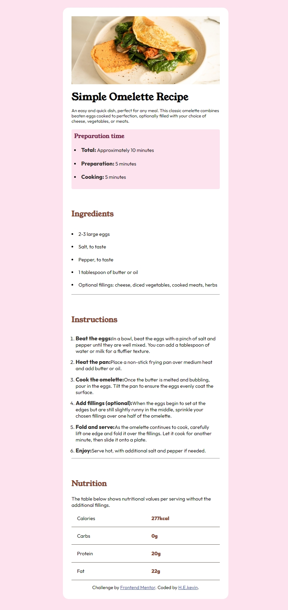

# Frontend Mentor - Recipe page solution

This is a solution to the [Recipe page challenge on Frontend Mentor](https://www.frontendmentor.io/challenges/recipe-page-KiTsR8QQKm). Frontend Mentor challenges help you improve your coding skills by building realistic projects.

## Table of contents

- [Overview](#overview)
  - [The challenge](#the-challenge)
  - [Links](#links)
- [My process](#my-process)
  - [Built with](#built-with)
  - [What I learned](#what-i-learned)
  - [Continued development](#continued-development)
  - [Useful resources](#useful-resources)
- [Author](#author)
- [Acknowledgments](#acknowledgments)

## Overview

### Screenshot



### Links

- Solution URL: [Add solution URL here](https://your-solution-url.com)
- Live Site URL: [Add live site URL here](https://your-live-site-url.com)

## My process

### Built with

- Semantic HTML5 markup
- CSS custom properties
- Flexbox
- Mobile-first workflow

### What I learned

During this project, I learned how to effectively use CSS Grid and Flexbox to create responsive layouts. I also improved my skills in semantic HTML5 markup and CSS custom properties.

```html
<ul>
	<li><span>Total:</span> Approximately 10 minutes</li>
	<li><span>Preparation:</span> 5 minutes</li>
	<li><span>Cooking:</span> 5 minutes</li>
</ul>
```

```css
@media all and (max-width: 375px) {
	#container {
		width: 37.5rem;
		margin: 0;
	}

	body {
		font-size: 16px;
	}

	p {
		font-size: 14px;
	}

	.attribution {
		font-size: 12px;
	}
}
```

### Continued development

I would like to focus more on writing more efficient and shorter code especially in css.

## Author

- Frontend Mentor - [H-E-kevin](https://www.frontendmentor.io/profile/H-E-kevin)
- Twitter - [Marchgiant](https://x.com/Marchingiant?t=THbg0pgjBmgWt1q5ZTqG0A&s=35)

```

```
